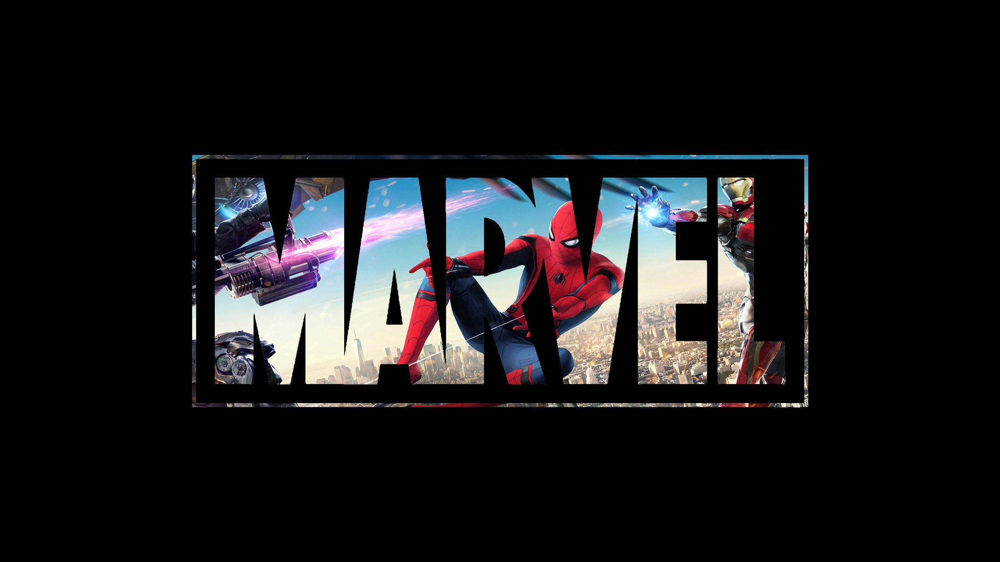

<div align="center">


<br>


### 🕷️ AI Enthusiast • 💻 Full-Stack Developer • 🎓 B.Tech Computer Science Student

> *"Building real-world software, exploring Artificial Intelligence, and turning ideas into impactful projects."*


<br>


<a href="https://github.com/Armaan029">

</a>

<a href="https://www.linkedin.com/in/bishnoi-armaan29/">

</a>

<a href="mailto:godaraarmaan29@gmail.com">

</a>

<a href="https://leetcode.com/Bishnoi_029">

</a>

</div>

---

# 🕷️ Origin Story

```javascript
const armaan = {
    name: "Armaan Bishnoi",
    role: "B.Tech Computer Science Engineering",
    location: "India 🇮🇳",

    currentlyLearning: [
        "Artificial Intelligence",
        "Data Structures & Algorithms",
        "Next.js",
        "Cloud Computing"
    ],

    interests: [
        "Full Stack Development",
        "Machine Learning",
        "Open Source",
        "Problem Solving"
    ],

    currentProject: "AI-Based Crowd Management System",

    mission: "Building intelligent software that solves real-world problems.",

    motto: "With Great Power Comes Great Responsibility 🕷️"
}
```


# 🕸️ Spider Gear

<p align="center">


</p>

<h3 align="center">

🕸️ "Anyone can win a fight. When things are tough and there seems to be no chance... that's when it counts."

</h3>

---

# 🎯 Missions Completed

| 🤖 AI Crowd Management System | 🌐 Personal Portfolio |
|:---:|:---:|
| AI-powered crowd monitoring using Computer Vision & AI. | Responsive personal portfolio website. |
| **Stack:** Python • OpenCV • Firebase | **Stack:** HTML • CSS • JavaScript |

| 👨‍💼 Employee Attendance System | ⚡ Electricity Bill Calculator |
|:---:|:---:|
| ⭐ One of my best Python projects with SQLite database. | Desktop application for electricity bill calculation. |
| **Stack:** Python • SQLite | **Stack:** Python |

---

# ⚡ Power Level

<p align="center">
  
</p>

---

# 🕸️ Web Activity

<p align="center">
  
</p>

---

# 🌐 Contact S.H.I.E.L.D.

<p align="center">

<a href="https://github.com/Armaan029">

</a>

<a href="https://www.linkedin.com/in/bishnoi-armaan29/">

</a>

<a href="mailto:godaraarmaan29@gmail.com">

</a>

<a href="https://leetcode.com/Bishnoi_029">

</a>

</p>

---
<h1 align="center">🕸️ Friendly Neighborhood Developer</h1>
<p align="center">

</p>

<div align="center">

## 🕷️ Thanks for Visiting My Universe

*"With Great Power Comes Great Responsibility."*

⭐ Follow my journey as I build AI, Full-Stack, and Cloud projects.

Made with ❤️ by **Armaan Bishnoi**


</div>
